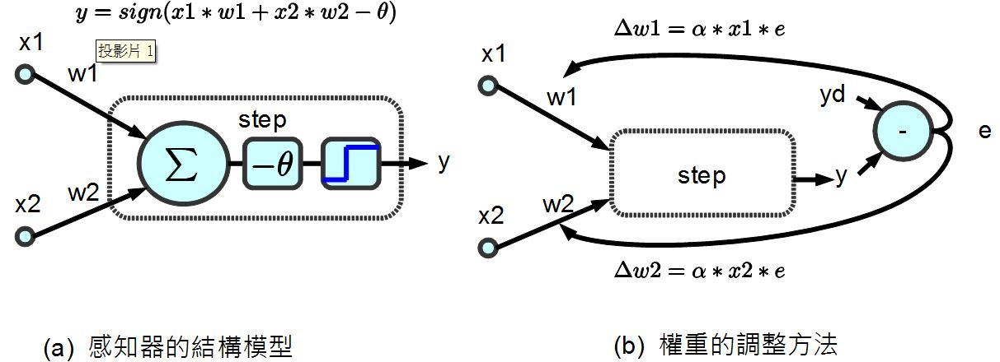
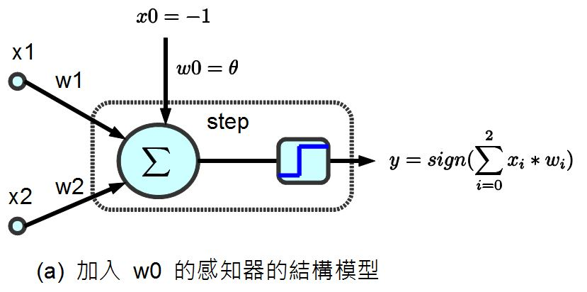
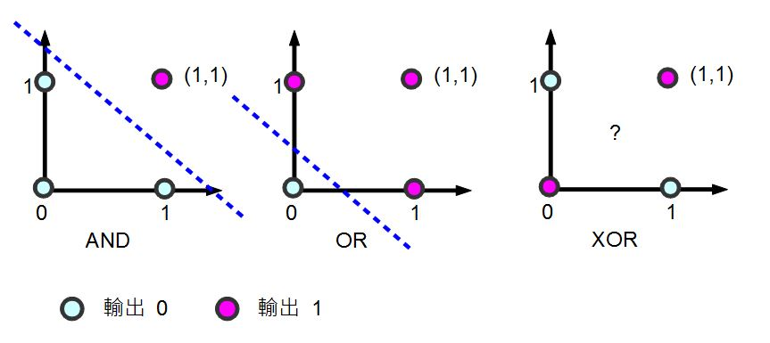

## 實作：單層感知器 (Perceptron)

### 簡介

Rosenblatt 於 1958 年提出第一個神經網路模型，稱為感知器，這個模型是基於 1943 年 McCulloch 與 Pitts 所提出的神經元模型，該模型的數學公式如下。

  

其中的 sign 是正負號判斷函數，若是正數則傳回 1，負數則傳回 0。

請注意，在此我們所說的「感知器」是指 Rosenblatt 當時所使用的感知器，特指只有一層節點的「單層感知器」，而不是指稱那種具有隱藏層的「多層感知器」(Multilayer Perceptron)，這點必須特別澄清一下！

而所謂感知器的學習，就是透過調整權重 wi 的方式，讓整個網路可以學到某個函數的方法，所以權重的調整方法是整個感知器學習行為的核心。

### 感知器的學習

那麼、我們要怎麼讓神經網路學會某個函數呢？以下是感知器學習的演算法：

1. 初始化：設定權重    和臨界值    的初值之範圍為 [-0.5, 0.5]。

2. 激勵：用輸入    、權重    與閥值    計算感知器的輸出值 Y。

	*   

3. 權重修改：根據函數輸出 Yd 與感知器輸出 Y 之間的差異，進行權重調整。

	* 3.1 計算誤差  ：   
	
	* 3.2 計算調整量：   
	
	* 3.3 調整權重  ：   

4. 重複 2-3 步驟，直到學會為止 (如果一直學不會，只好宣告失敗)。

### 感知器模型 (兩個輸入的情況)

根據以上的方法，假如感知器的輸入只有兩個    那麼權重也只會有兩個   ，於是我們可以得到下列的感知器模型：



假如我們的目標函數對於某組 (x1, x2) 的期望輸出為 yd，那麼就可以計算出誤差為 e=yd-y，於是我們可以透過下列方法調整權重。

  

  

可惜的是、上述的調整方法中，並沒有調整到    值，如果我們想要連    值也一並設計成可浮動的，那麼就可以將    加入到 w 中，成為 w0，，並將 x0 設為 -1，如下圖所示：



經過上述的調整簡化之後，我們只要在調整權重時加入下列這條，就可以連    也一併調整了。

  

當我們對某布林函數「真值表」中的每一個輸入，都反覆進行上述調整，最後是否能學會該「布林函數」呢？

那麼、我們是否能夠用這麼簡單的方法讓感知器學會 AND、OR 與 XOR 函數呢？

如果可以的話，那麼我們能不能擴大到 n 輸入的感知器上，讓感知器學會任何一個布林函數呢？

如果感知器可以學會任何一個布林函數，那就會具有強大的威力了！

但可惜的是，這個問題的答案是否定的，雖然感知器可以學會 AND 與 OR，但是卻不可能學會 XOR 函數。

在說明這個問題的理論之前，先讓我們透過實作來體會一下感知器是如何學習 AND 與 OR 函數的，然後感受一下感知器在學 XOR 函數時發生了甚麼問題？

等到瞭解了程式的運作原理之後，我們再來說明為何感知器無法學會 XOR 函數。

### 感知器實作

以下我們使用 JavaScript 程式實作出感知器，其程式碼如下，您可以在 node.js 環境下執行此一程式：

檔案：perceptron.js

```javascript
var log = console.log;

var Perceptron = function() { // 感知器物件
  this.step=function(x, w) { // 步階函數：計算目前權重 w 的情況下，網路的輸出值為 0 或 1
    var result = w[0]*x[0]+w[1]*x[1]+w[2]*x[2]; // y=w0*x0+x1*w1+x2*w2=-theta+x1*w1+x2*w2
    if (result >= 0) // 如果結果大於零
      return 1;      //   就輸出 1
    else             // 否則
      return 0;      //   就輸出 0
  }
  
  this.training=function(truthTable) { // 訓練函數 training(truthTable), 其中 truthTable 是目標真值表
    var rate = 0.01; // 學習調整速率，也就是 alpha
    var w = [ 1, 0, 0 ]; 
    for (var loop=0; loop<1000; loop++) { // 最多訓練一千輪
      var eSum = 0.0;
      for (var i=0; i<truthTable.length; i++) { // 每輪對於真值表中的每個輸入輸出配對，都訓練一次。
        var x = [ -1, truthTable[i][0], truthTable[i][1] ]; // 輸入： x
        var yd = truthTable[i][2];       // 期望的輸出 yd
        var y = this.step(x, w);  // 目前的輸出 y
        var e = yd - y;                  // 差距 e = 期望的輸出 yd - 目前的輸出 y
        eSum += e*e;                     // 計算差距總和
        var dw = [ 0, 0, 0 ];            // 權重調整的幅度 dw
        dw[0] = rate * x[0] * e; w[0] += dw[0]; // w[0] 的調整幅度為 dw[0]
        dw[1] = rate * x[1] * e; w[1] += dw[1]; // w[1] 的調整幅度為 dw[1]
        dw[2] = rate * x[2] * e; w[2] += dw[2]; // w[2] 的調整幅度為 dw[2]
        if (loop % 10 == 0)
          log("%d:x=(%s,%s,%s) w=(%s,%s,%s) y=%s yd=%s e=%s", loop, 
	           x[0].toFixed(3), x[1].toFixed(3), x[2].toFixed(3), 
	           w[0].toFixed(3), w[1].toFixed(3), w[2].toFixed(3), 
	           y.toFixed(3), yd.toFixed(3), e.toFixed(3));
      }
      if (Math.abs(eSum) < 0.0001) return w; // 當訓練結果誤差夠小時，就完成訓練了。
    }
    return null; // 否則，就傳會 null 代表訓練失敗。
  }
}

function learn(tableName, truthTable) { // 學習主程式：輸入為目標真值表 truthTable 與其名稱 tableName。
  log("================== 學習 %s 函數 ====================", tableName);
  var p = new Perceptron();       // 建立感知器物件
  var w = p.training(truthTable); // 訓練感知器
  if (w != null)                  // 顯示訓練結果
    log("學習成功 !");
  else
    log("學習失敗 !");
  log("w=%j", w);
}

var andTable = [ [ 0, 0, 0 ], [ 0, 1, 0 ], [ 1, 0, 0 ], [ 1, 1, 1 ] ]; // AND 函數的真值表
var orTable  = [ [ 0, 0, 0 ], [ 0, 1, 1 ], [ 1, 0, 1 ], [ 1, 1, 1 ] ]; // OR  函數的真值表
var xorTable = [ [ 0, 0, 0 ], [ 0, 1, 1 ], [ 1, 0, 1 ], [ 1, 1, 0 ] ]; // XOR 函數的真值表

learn("and", andTable); // 學習 AND 函數
learn("or",  orTable);  // 學習 OR  函數
learn("xor", xorTable); // 學習 XOR 函數
```

執行結果

```
D:\Dropbox\Public\web\ai\code>node perceptron.js
================== 學習 and 函數 ====================
0:x=(-1.000,0.000,0.000) w=(1.000,0.000,0.000) y=0.000 yd=0.000 e=0.000
0:x=(-1.000,0.000,1.000) w=(1.000,0.000,0.000) y=0.000 yd=0.000 e=0.000
0:x=(-1.000,1.000,0.000) w=(1.000,0.000,0.000) y=0.000 yd=0.000 e=0.000
0:x=(-1.000,1.000,1.000) w=(0.990,0.010,0.010) y=0.000 yd=1.000 e=1.000
10:x=(-1.000,0.000,0.000) w=(0.900,0.100,0.100) y=0.000 yd=0.000 e=0.000
10:x=(-1.000,0.000,1.000) w=(0.900,0.100,0.100) y=0.000 yd=0.000 e=0.000
10:x=(-1.000,1.000,0.000) w=(0.900,0.100,0.100) y=0.000 yd=0.000 e=0.000
10:x=(-1.000,1.000,1.000) w=(0.890,0.110,0.110) y=0.000 yd=1.000 e=1.000
20:x=(-1.000,0.000,0.000) w=(0.800,0.200,0.200) y=0.000 yd=0.000 e=0.000
20:x=(-1.000,0.000,1.000) w=(0.800,0.200,0.200) y=0.000 yd=0.000 e=0.000
20:x=(-1.000,1.000,0.000) w=(0.800,0.200,0.200) y=0.000 yd=0.000 e=0.000
20:x=(-1.000,1.000,1.000) w=(0.790,0.210,0.210) y=0.000 yd=1.000 e=1.000
30:x=(-1.000,0.000,0.000) w=(0.700,0.300,0.300) y=0.000 yd=0.000 e=0.000
30:x=(-1.000,0.000,1.000) w=(0.700,0.300,0.300) y=0.000 yd=0.000 e=0.000
30:x=(-1.000,1.000,0.000) w=(0.700,0.300,0.300) y=0.000 yd=0.000 e=0.000
30:x=(-1.000,1.000,1.000) w=(0.690,0.310,0.310) y=0.000 yd=1.000 e=1.000
學習成功 !
w=[0.6599999999999997,0.34000000000000014,0.34000000000000014]
================== 學習 or 函數 ====================
0:x=(-1.000,0.000,0.000) w=(1.000,0.000,0.000) y=0.000 yd=0.000 e=0.000
0:x=(-1.000,0.000,1.000) w=(0.990,0.000,0.010) y=0.000 yd=1.000 e=1.000
0:x=(-1.000,1.000,0.000) w=(0.980,0.010,0.010) y=0.000 yd=1.000 e=1.000
0:x=(-1.000,1.000,1.000) w=(0.970,0.020,0.020) y=0.000 yd=1.000 e=1.000
10:x=(-1.000,0.000,0.000) w=(0.700,0.200,0.200) y=0.000 yd=0.000 e=0.000
10:x=(-1.000,0.000,1.000) w=(0.690,0.200,0.210) y=0.000 yd=1.000 e=1.000
10:x=(-1.000,1.000,0.000) w=(0.680,0.210,0.210) y=0.000 yd=1.000 e=1.000
10:x=(-1.000,1.000,1.000) w=(0.670,0.220,0.220) y=0.000 yd=1.000 e=1.000
20:x=(-1.000,0.000,0.000) w=(0.460,0.340,0.340) y=0.000 yd=0.000 e=0.000
20:x=(-1.000,0.000,1.000) w=(0.450,0.340,0.350) y=0.000 yd=1.000 e=1.000
20:x=(-1.000,1.000,0.000) w=(0.440,0.350,0.350) y=0.000 yd=1.000 e=1.000
20:x=(-1.000,1.000,1.000) w=(0.440,0.350,0.350) y=1.000 yd=1.000 e=0.000
學習成功 !
w=[0.37999999999999945,0.38000000000000017,0.38000000000000017]
================== 學習 xor 函數 ====================
0:x=(-1.000,0.000,0.000) w=(1.000,0.000,0.000) y=0.000 yd=0.000 e=0.000
0:x=(-1.000,0.000,1.000) w=(0.990,0.000,0.010) y=0.000 yd=1.000 e=1.000
0:x=(-1.000,1.000,0.000) w=(0.980,0.010,0.010) y=0.000 yd=1.000 e=1.000
0:x=(-1.000,1.000,1.000) w=(0.980,0.010,0.010) y=0.000 yd=0.000 e=0.000
10:x=(-1.000,0.000,0.000) w=(0.800,0.100,0.100) y=0.000 yd=0.000 e=0.000
10:x=(-1.000,0.000,1.000) w=(0.790,0.100,0.110) y=0.000 yd=1.000 e=1.000
10:x=(-1.000,1.000,0.000) w=(0.780,0.110,0.110) y=0.000 yd=1.000 e=1.000
10:x=(-1.000,1.000,1.000) w=(0.780,0.110,0.110) y=0.000 yd=0.000 e=0.000
...
900:x=(-1.000,0.000,0.000) w=(0.010,-0.010,-0.000) y=1.000 yd=0.000 e=-1.000
900:x=(-1.000,0.000,1.000) w=(-0.000,-0.010,0.010) y=0.000 yd=1.000 e=1.000
900:x=(-1.000,1.000,0.000) w=(-0.010,-0.000,0.010) y=0.000 yd=1.000 e=1.000
900:x=(-1.000,1.000,1.000) w=(-0.000,-0.010,-0.000) y=1.000 yd=0.000 e=-1.000
...
990:x=(-1.000,0.000,0.000) w=(0.010,-0.010,-0.000) y=1.000 yd=0.000 e=-1.000
990:x=(-1.000,0.000,1.000) w=(-0.000,-0.010,0.010) y=0.000 yd=1.000 e=1.000
990:x=(-1.000,1.000,0.000) w=(-0.010,-0.000,0.010) y=0.000 yd=1.000 e=1.000
990:x=(-1.000,1.000,1.000) w=(-0.000,-0.010,-0.000) y=1.000 yd=0.000 e=-1.000
學習失敗 !
w=null
```

### 分析

您可以看到在上述執行結果中， AND 與 OR 兩個真值表，輸入到單層感知器進行訓練之後，都可以正確的進行學習，也就是單層感知器的輸出可以與該真值表完全一致，這代表單層感知器學習成功了。

但是對於 XOR 這個真值表，單層感知器卻無法讓輸出與真值表完全一致，這也正是 Minsky 所說的，單層感知器無法正確學習 XOR 函數的原因。

會產生這個現象的原因，可以用線性代數的概念解釋，下圖顯示了 AND, OR, XOR 等這三個真值表在二維線性空間的狀況，其中的粉紅色圓圈代表真值表的目標輸出值為 1，而淺藍色圓圈代表目標輸出為 0。



您可以看到對於 AND 與 OR 都可以用一條線將「粉紅色圓圈」與「淺藍色圓圈」分割開來。但是對 XOR 而言，由於粉紅色與淺藍色分別處於斜對角，我們沒有辦法畫出單一條線將兩者分開，這也是會何上述單層感知器在學習 XOR 這個函數上會失敗的原因了。

### 結語

可惜的是，單層感知器並沒有辦法學會任意的布林函數，這個結果雖然令人失望，但是期望這麼簡單的模型就能擁有強大的能力，其實是一種非常天真的想法。

不過、如果我們將這種單層的網路繼續擴充，變成雙層以上的網路的話，其能力就會大大的提升了，這也就是我們接下來要探討的主題，反傳遞演算法 (Back-Propagation Algorithm) 了。

### 參考文獻
* [Wikipedia:Perceptron](http://en.wikipedia.org/wiki/Perceptron)
* [維基百科：感知器](http://zh.wikipedia.org/wiki/%E6%84%9F%E7%9F%A5%E5%99%A8)

【本文由陳鍾誠取材並修改自 [維基百科]，採用創作共用的 [姓名標示、相同方式分享] 授權】

